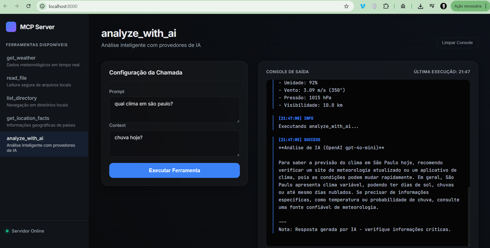
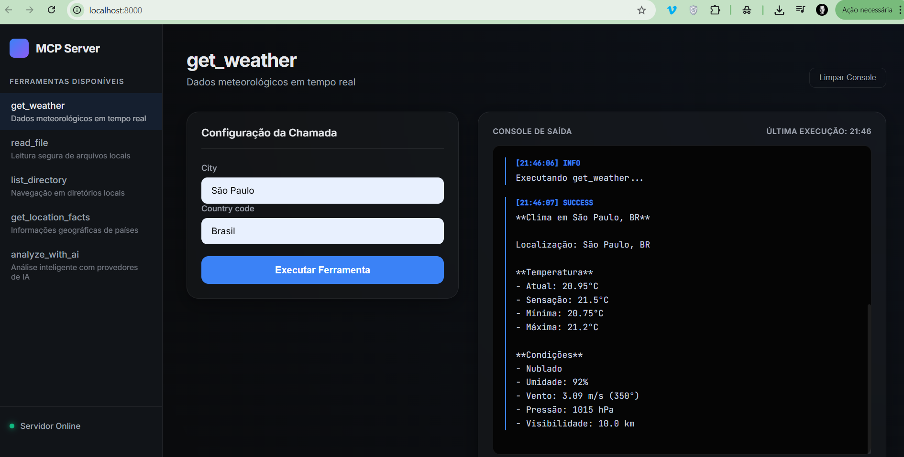

# MCP Weather & Files AI Server

Servidor avançado baseado no protocolo Model Context Protocol (MCP), oferecendo integração com dados meteorológicos em tempo real, acesso ao sistema de arquivos local e análise inteligente de dados para clientes compatíveis com MCP.

### Demonstração Visual

<table>
  <tr>
    <td></td>
    <td></td>
  </tr>
</table>

Esta interface permite simular chamadas de ferramentas, visualizar logs em tempo real e validar a conectividade com as APIs externas de forma visual.

## Funcionalidades

- **Dados Meteorológicos**: Informações em tempo real via OpenWeatherMap.org.
- **Gerenciamento de Arquivos**: Leitura segura de arquivos locais e navegação em diretórios.
- **Informações Geográficas**: Dados detalhados sobre países e regiões via RestCountries API.
- **Análise com Inteligência Artificial**: Integração com OpenAI (provedor primário) e Anthropic (fallback automático).
- **Arquitetura Assíncrona**: Implementação de alta performance utilizando asyncio e httpx.

## Ferramentas Disponíveis

### 1. `get_weather`
Recupera condições climáticas atuais para uma cidade específica.
- `city` (string): Nome da cidade.
- `country_code` (string, opcional): Código ISO do país.

### 2. `read_file`
Realiza a leitura de arquivos de texto locais de forma segura.
- `file_path` (string): Caminho absoluto ou relativo do arquivo.

### 3. `list_directory`
Lista o conteúdo de diretórios locais com metadados de arquivos.
- `directory_path` (string): Caminho do diretório alvo.

### 4. `get_location_facts`
Fornece dados demográficos e geográficos de um país.
- `country` (string): Nome comum ou oficial do país.

### 5. `analyze_with_ai`
Realiza análises complexas e gera recomendações através de LLMs.
- `prompt` (string): Task ou pergunta para análise.
- `context` (string, opcional): Dados suplementares para a análise.
- **Estratégia**: Utiliza GPT-4o-mini por padrão, com failover para Claude 3.5 Sonnet em caso de falha.

## Requisitos Técnicos

- Python 3.10 ou superior
- MCP SDK
- httpx
- asyncio
- Pydantic

## Instalação

```bash
# Clonar o repositório
git clone https://github.com/gabriellsanabria/mcp-weather-server.git
cd mcp-weather-server

# Configurar ambiente virtual
python -m venv venv
# Ativação Windows: .\venv\Scripts\activate
# Ativação Linux/Mac: source venv/bin/activate

# Instalar dependências
pip install -r requirements.txt
```

## Configuração

1. Obtenha uma chave de API em [OpenWeatherMap.org](https://openweathermap.org/api).
2. Configure as variáveis de ambiente no arquivo `.env` (baseado no `.env.example`):
   ```bash
   WEATHER_API_KEY="sua_chave_aqui"
   OPENAI_API_KEY="sua_chave_aqui"
   ANTHROPIC_API_KEY="sua_chave_aqui"
   ```

## Integração com Claude Desktop

Adicione a seguinte configuração ao seu arquivo `claude_desktop_config.json`:

```json
{
  "mcpServers": {
    "weather-files-ai": {
      "command": "python",
      "args": ["C:/caminho/para/server.py"],
      "env": {
        "WEATHER_API_KEY": "sua_chave",
        "OPENAI_API_KEY": "sua_chave",
        "ANTHROPIC_API_KEY": "sua_chave"
      }
    }
  }
}
```

## Dashboard Web

O projeto inclui uma interface de gerenciamento moderna para testar as ferramentas e visualizar o status do servidor via navegador.

### Como Executar:

1. Inicie a API do Dashboard:
   ```bash
   python api.py
   ```
2. Acesse no navegador:
   👉 **[http://localhost:8000](http://localhost:8000)**

### Demonstração Visual

<table>
  <tr>
    <td></td>
    <td></td>
  </tr>
</table>

Esta interface permite simular chamadas de ferramentas, visualizar logs em tempo real e validar a conectividade com as APIs externas de forma visual.


## Segurança

- Validação de caminhos para prevenir ataques de directory traversal.
- Operações de arquivo restritas à leitura (read-only).
- Esquemas de ferramentas rigorosamente definidos.

## Licença

MIT

## Autor

Gabriel Sanabria
